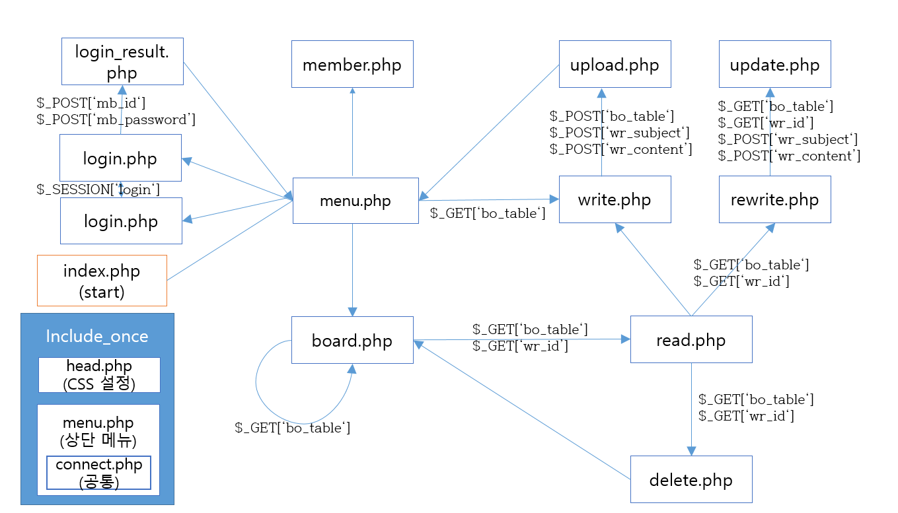

# SimplePhpMysqlHompage
Study Simple PHP &amp; MySQL Homepage. It is helpful to study GNUboard or Wordpress

This is very simple homepage using PHP5.0  & MySQL5.0 
I Make this Homepage for my Class; Database.
Todays homepage is not made by HTML&CSS&JS. It is synclonized DB & HTML, and a Part of synclonizing is PHP(or NodeJS, Ruby, Pearl etc..)
For example, Wordpress and Gnuboard are good Homepage using PHP&Mysql. However, understanding the structure of these homepage is too difficult, because these are getting complecated more and more. 
So, I make simple homepage to understand this structure. It is quiet simple and you can find simmular .php in bbc/ in Gnuboard.
If you want to know what Back-End programming is or understand what structure of homepage is.

I recommend you to study PHP & SQL. I guess PHP is so easy if you have aleady studied coding, but SQL(language of Managing Database) is not easy.
It's OK. Just try it. 

## HOMEPAGE Structure

I don't insert structure of Chatroom(using Ajax). 

## Acting Sample Homepage
[Acting Homepage](http://soori.ivyro.net/test/)
You can easily make a Free Webserver; during 6month.

## Ducuments (Korean)
[Documents](http://haipin.ivyro.net/bbs/board.php?bo_table=database)
That is written as Korean. Format is HWP(한글과 컴퓨터). 

If you have any questing, please use Issues.

Thanks!
